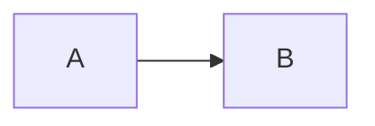

# Invalid Mermaid Diagrams

This file contains invalid mermaid diagrams for testing.

## Invalid Syntax

```mermaid
graph TD
    A[Start --> B[End]
```

This has a missing closing bracket.

## Empty Mermaid Block

```mermaid
```

## Invalid Diagram Type

```mermaid
invalidtype XYZ
    A --> B
```

## Mixed Valid and Invalid

Here's a valid one first:



And then an invalid one:

```mermaid
sequenceDiagram
    Alice->Bob: Missing second arrow
    Bob-->>Alice
```

End of document.