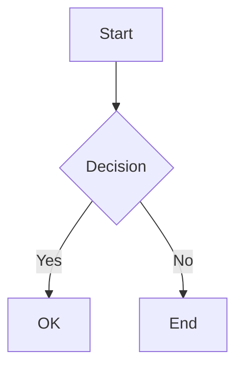
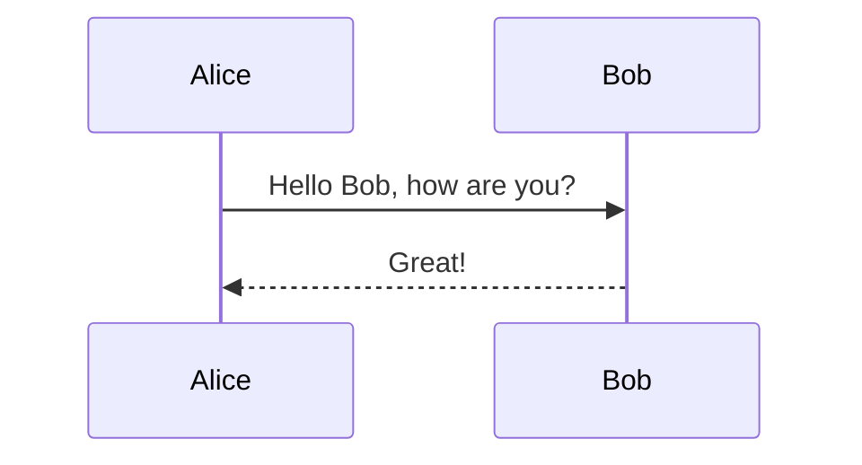
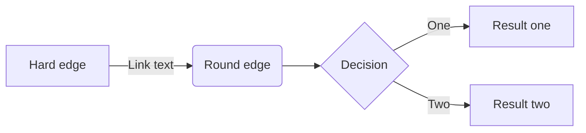

# Valid Mermaid Diagrams

This file contains valid mermaid diagrams for testing.

## Simple Graph



## Sequence Diagram

Some text between diagrams.



## Flowchart



## Regular Code Block

This is not a mermaid block:

```javascript
console.log("Hello, world!");
```

End of document.